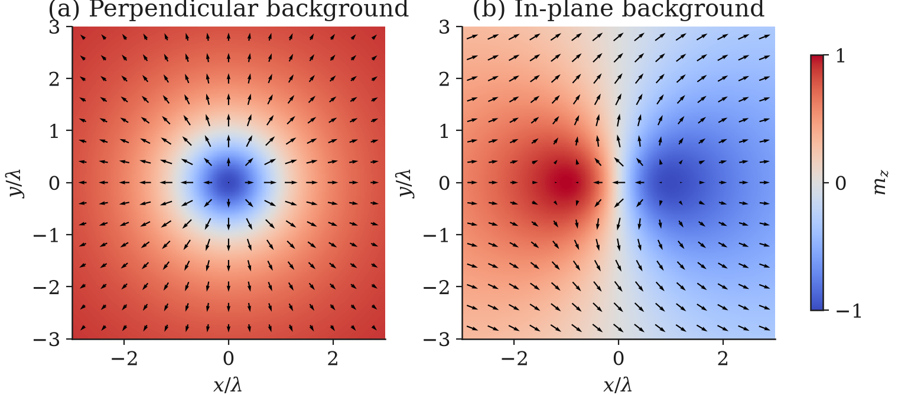
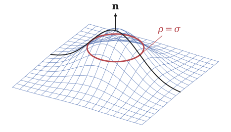
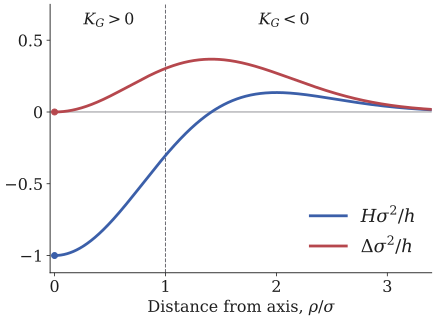

# Bimerons in Curved Geometry

**Analytical modeling and Lean 4 verification of curvature-dependent magnetic energies.**

How does surface curvature modify the energetic landscape of topological magnetic
textures such as bimerons? This project connects **physics**, **analytical modeling**
and **formal verification in Lean 4** through a ferromagnetic thin-shell model.
Its quantitative results concern local curvature couplings and a rigid-pair energy,
with explicit assumptions and limits.

## Scientific motivation and physical model

Geometry changes the competition between exchange, anisotropy, magnetostatics,
Dzyaloshinskii–Moriya interaction and Zeeman energy. For a thin shell of constant
normal thickness $t$, with unit magnetization uniform through the thickness,

```math
\displaystyle E_{\mathrm{ex}}=At\int g^{ab}\partial_a\mathbf m\cdot\partial_b\mathbf m\,dS.
```

Here $A$ is the exchange stiffness and $g^{ab}$ the inverse surface metric.
A moving orthonormal frame introduces the geometric connection into derivatives
of the magnetization. The resulting exchange contains terms linear and quadratic
in curvature; they are already part of Cartesian exchange, not additional energies.
The background, boundary conditions and other interactions remain essential.

## Curvature-induced exchange and axial textures

We use $H=(\kappa_1+\kappa_2)/2$, $\Delta=(\kappa_1-\kappa_2)/2$ and
$K_G=\kappa_1\kappa_2$, with the sign convention specified in the
[analytical model](docs/ANALYTICAL_MODEL.md).
For a small axial core, $\Phi=q\varphi+\chi$, and approximately uniform curvature
over that core, angular averaging of the linear exchange term selects
$H\cos\chi$ for $q=+1$ and $\Delta\cos(\chi-2\alpha)$ for $q=-1$.
This is a local winding-dependent coupling, not a universal stability criterion
based on the sign of $K_G$.

## Bimerons and topology

For an oriented surface, the physical Cartesian magnetization defines

```math
\displaystyle Q=\frac{1}{4\pi}\int\mathbf m\cdot
(\partial_u\mathbf m\times\partial_v\mathbf m)\,du\,dv.
```

A conventional skyrmion has a perpendicular background. An axial meron covers
half the spin sphere and has $Q=pq/2$ under equatorial boundary conditions.
Here “meron” and “antimeron” denote $q=+1$ and $q=-1$, with polarity $p$ stated
separately. Opposite windings and opposite polarities give a bimeron with
$Q=\pm1$ in the idealized two-core description. Topological charge alone does not
establish energetic stability.

<p align="center">
  
</p>

A proper global spin rotation preserves the charge density and isotropic exchange.
The illustrated analytic fields are not relaxed states of the full magnetic energy.

## Gaussian geometry

The application uses $f(\rho)=h\exp[-\rho^2/(2\sigma^2)]$, with an upward normal
and radial/azimuthal principal directions. The rigid-pair model gives position
and orientation dependence, gradients, stiffnesses and mixed couplings. Forces
are the negatives of the energy gradients.

<p align="center">
  
  
</p>

The surface rendering is schematic; the curvature curves use the **small-slope
limit**, while the formal project also treats exact Gaussian expressions.
See [figure definitions and provenance](figures/README.md), including the
[pair-coordinate diagram](figures/pair_coordinates.svg).

## Lean 4 formal verification

**145 compiled theorems, 13 proof modules, 15 Lean source files.** There are no
separate `lemma` declarations. The [calculation map](docs/CALCULATION_MAP.md)
connects **71 scientific calculation items** to all 145 declarations and retains
22 historical equation identifiers. These are different counting units.

The proofs cover curvature identities, angular selection, Gaussian derivatives,
reduced-energy coefficients, symmetries and finite-dimensional Hessian/Schur results.
The map distinguishes exact identities, conditional statements, algebra after
physical reduction and calculations whose full analytical treatment remains open.
See [formalization scope](docs/FORMALIZATION_SCOPE.md) and
[validation record](docs/VALIDATION.md).

> Lean verifies the mathematical statements that were explicitly formalized under
> their stated assumptions; it does not by itself establish the full physical or
> dynamical stability of a bimeron configuration.

## Repository structure

```text
lean/       Pinned Lean project, 13 proof modules and axiom audit
scripts/    Figure reproduction and standalone formalization audit
figures/    Original SVG/PNG illustrations and curvature data
docs/      Calculation map, analytical model, scope and validation
```

## Building the Lean project

Install [Lean via elan](https://leanprover-community.github.io/install/project.html).
From the repository root:

```sh
cd lean
lake exe cache get
lake build
lake env lean AuditAxioms.lean
cd ..
python3 scripts/audit_formalization.py --check-axioms
```

`lean-toolchain` pins **Lean 4.19.0**. Mathlib is **v4.19.0**, commit
`c44e0c8ee63ca166450922a373c7409c5d26b00b`; `lake-manifest.json` also pins transitive
dependencies. The cache command resolves these pins on a fresh checkout. No
`lake update` is needed. Initial dependency downloads require network access;
`.lake/` is generated locally and is not distributed.

## Reproducing selected figures

The figure scripts use Python 3.12, NumPy and Matplotlib; no TeX installation,
report assets or simulation datasets are needed.

```sh
python3 -m venv .venv
. .venv/bin/activate
python -m pip install -r requirements.txt
python scripts/generate_figures.py
```

The generator also checks the spin-field norm and compares the plotted curvature
limit with exact expressions. These numerical checks supplement, and do not
replace, the formal proofs.

## Research status and limitations

The analysis does not establish a fully relaxed stable bimeron on the Gaussian
surface. The complete magnetostatic contribution of the pair, connecting region,
background and internal-mode relaxation remain unresolved. Local magnetostatic
harmonics reproduce the selection structure only in the stated axial regime.
No complete stability spectrum, annihilation barrier, metastability assessment
or lifetime has been computed. A stationary point and positive reduced positional
Hessian would still need testing against the remaining degrees of freedom.

## Research context

Undergraduate research by **Amir Bachar Saadeddine**, supervised by
**Prof. Jakson Miranda Fonseca**, Department of Physics, Universidade Federal de
Viçosa (UFV), Brazil. The project belongs to **PIBIC/UFV, 2025–2026**, with CNPq
support acknowledged in the project presentation. Its official title is
*Influência da geometria em excitações magnéticas e em materiais quânticos*.
This repository presents the curved-magnetism research only.

## References

- Gaididei, Kravchuk and Sheka, *Curvature Effects in Thin Magnetic Shells*,
  Physical Review Letters **112**, 257203 (2014).
  [DOI](https://doi.org/10.1103/PhysRevLett.112.257203)
- Sheka, Kravchuk and Gaididei, *Curvature effects in statics and dynamics of low
  dimensional magnets*, Journal of Physics A **48**, 125202 (2015).
  [DOI](https://doi.org/10.1088/1751-8113/48/12/125202)
- Göbel et al., *Magnetic bimerons as skyrmion analogues in in-plane magnets*,
  Physical Review B **99**, 060407(R) (2019).
  [DOI](https://doi.org/10.1103/PhysRevB.99.060407)
- Elías, Vidal-Silva and Carvalho-Santos, *Winding number selection on merons by
  Gaussian curvature’s sign*, Scientific Reports **9**, 14309 (2019).
  [DOI](https://doi.org/10.1038/s41598-019-50395-7)

Report sources, PDFs and third-party articles are deliberately excluded.

## License

This project is licensed under the BSD 3-Clause License. See [LICENSE](LICENSE) for details.
